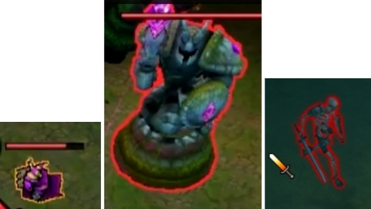

# Видеозапись лекции (две части)

<a href="https://www.youtube.com/watch?v=LbyUK7qZHx8"></a> <a href="https://www.youtube.com/watch?v=lzmm-8Kcn6Y"></a>

# Графический пайплайн на GPU (Vulkan/OpenGL)


# Как скомпилировать и запустить юнит-тесты

Проект тестировался на ```Ubuntu 22.04```, ```gcc 11.4```, ```CUDA 11.8``` (нужна если планируется использовать ```CUDA```, для ```Vulkan``` - не требуется).

1) Скачать исходники
2) Выполнить ```scripts/configure-linux.sh``` из-под ```sudo``` (установит зависимости - ```googletest``` и ```Vulkan```-овские) 
3) ```mkdir build; cd build```
4) ```cmake ..```
5) ```make -j16```
6) Запустить юнит-тесты чтобы проверить что все работает: ```LD_LIBRARY_PATH=/usr/local/lib libs/gpu/libgpu_test``` (выставить ```LD_LIBRARY_PATH``` нужно чтобы нашлись валидационные слои, чтобы не было ошибки ```Vulkan debug callback triggered with libVkLayer_khronos_validation.so: cannot open shared object file: No such file or directory```, или более простой вариант - скопировать в системную папку: ```sudo cp /usr/local/lib/libVkLayer_khronos_validation.so /usr/lib/```)

### Не выполнился скрипт configure-linux.sh

Установка валидационных слоев может навернуться с ошибкой:

```
Cloning into '.'...
error: RPC failed; curl 92 HTTP/2 stream 0 was not closed cleanly: CANCEL (err 8)
error: 1321 bytes of body are still expected
fetch-pack: unexpected disconnect while reading sideband packet
fatal: early EOF
fatal: fetch-pack: invalid index-pack output
```

В таком случае помогает выполнить ```git config --global http.postBuffer 524288000```, закомментировать строку распаковки архива ```unzip Vulkan-ValidationLayers-${vulkan_validation_layers_version}.zip``` и запустить скрипт снова.

В целом валидационные слои опциональны - проект будет работать и без них, но они полезны для того чтобы проверить корректность использования Vulkan API.

# Запустите отрисовку гнома


# Как отлаживать

### Как отлаживать с помощью rassert-ов

Стараться их вставлять везде где есть очевидный инвариант.

Поставить отладочную точку остановки в файле ```libs/base/libbase/runtime_assert.h``` - в любой строке функции ```debugPoint(...)```.

### Как отлаживать с помощью валидационных слоев (Validation Layers)

Поставить отладочную точку остановки в файле ```libs/gpu/libgpu/vulkan/engine.cpp``` - в конце функции ```debugCallback(...)``` - на строке ```return VK_FALSE;```.

### Как отлаживать с помощью RenderDoc

1) Скачайте отсюда - https://renderdoc.org/
2) Распакуйте: ```tar -zxf renderdoc_1.35.tar.gz```
3) Запустите: ```renderdoc_1.35/bin/qrenderdoc```
4) Укажите в ```Executable Path```: ```.../120_main_render_gnome```
5) Проверьте ```Working Directory``` - она должна указывать на корневую папку проекта (т.к. картинка текстуры и ply геометрии грузятся по относительным путям)
6) В проекте убедитесь что в ```libs/gpu/libgpu/vulkan/vk/common_host.h``` макрос ```ENABLE_AND_ENSURE_RENDERDOC``` выставлен в 1
7) Перекомпилируйте проект и в RenderDoc запустите кнопкой ```Launch```
8) Если во вкладке пустой белый фон - не появилось захваченных отрисовок - проверьте вкладку ```Launch Application``` - может быть там появилось ```Warning: Vulkan capture is not configured.``` - нажмите на него, выполните настройку и нажмите ```Launch``` снова
9) Не забудьте кусок кода-интереса обернуть в ```renderDocStartCapture(...)``` и ```renderDocEndCapture()``` - см. пример в ```120_main_render_gnome.cpp```

# Запуск 


# Упражнения

### 1) Как ускорить прогрузку данных

Пусть нам нужно прогрузить данные ```RAM -> VRAM```.

В Vulkan это имеет примерно такой условный общий вид:

```cpp
void write(void* data_cpu, avk2::raii::BufferData vk_data_gpu, size_t size) {
    avk2::raii::BufferData vk_data_staging_buffer = vk::allocateStagingBuffer(size);
    memcpy(dst=vk_data_staging_buffer, src=data_cpu, size); // грузим из RAM -> staging buffer (тоже RAM)

    vk::raii::CommandBuffer vk_command_buffer;
    vk_command_buffer.copyBuffer(src=vk_data_staging_buffer, dst=vk_data_gpu, size) // грузим staging buffer (RAM) -> VRAM
    submitCommandBuffer(vk_command_buffer);
}
```

```Упражнение 101``` Заметьте что здесь целых три дорогих операции. Какие?

```Упражнение 102``` Есть ли неэффективность в такой реализации? Насытим ли мы полностью пропускную способность PCI-E шины?

См. подробнее в ```avk2::VulkanEngine::writeBuffer(...)```.

```Упражнение 103``` Заметьте что юнит-тест ```TEST(vulkan, writeRead)``` в ```aplusb_test.cpp``` замеряет как раз это. А как минимальными изменениями в коде опять сделать ```writeBuffer(...)``` наивным? (чтобы замерить его медленную версию)

### 2) Валидационные слои (Validation Layers) помогают проверить корректность

```Упражнение 201``` Давайте закомментируем один из ```addAttachment(...)``` вызовов в ```120_main_render_gnome.cpp``` и запустим его - заметьте что валидационные слои сразу обнаружили проблему.

### 3) rassert-ы на видеокарте

```Упражнение 301``` Давайте закомментируем ```kernel_gnome_min_max.exec(...)``` вызов, тем самым сделав оценку минимальных-максимальных координат не корректной и давайте запустим это - сработала простая ```rassert```-проверка на тривиальный инвариант и нас подстраховала!

```Упражнение 302``` Как можно реализовать подобный механизм ```rassert```-ов на GPU? Посмотрите как он реализован в ```rassert.vk```, ```avk2::VulkanKernel::checkRassertCode()```.

```Упражнение 303``` А что если в кернеле нет ни одного ```rassert``` вызова? Получается зря будет вызвана прогрузка 8 байт из видеопамяти чтобы проверить что код ошибки не выставлен? Всегда ли это делается в коде?

```Упражнение 304``` Попробуйте применить рефлексию для анализа SPIR-V байткода - выберите любой ```.spir``` файл в ```src/vk/generated_kernels/``` папке, запустите на нем из терминала: ```/usr/local/bin/spirv-reflect .../generated_kernels/...spir```

```Упражнение 305``` Попробуйте удалить все использования ```rassert``` в кернеле, перекомпилировать ```.spir``` файл и посмотреть вновь через ```spirv-reflect```.

```Упражнение 306``` А что делать если все-равно есть подозрение что все эти ```rassert```-ы сильно замедляют? Как подтвердить/отвергнуть опасения?

### 4) Борьба с out-of-bounds / buffer-overflow

```Упражнение 401``` Какие часто бывают баги вообще? А на GPU?

```Упражнение 402``` Что будет если в кернеле пишется результат в ячейку ```buffer[gl_GlobalInvocationID.x] = 123;```, но оказалось что рабочее пространство не было кратно размеру рабочей группы, оно было округлено и... Что может произойти?

```Упражнение 403``` Что будет если в адресном пространстве куда произошло ```out-of-bounds write``` - находились 8 байт выделенные под ```rassert```?

```Упражнение 404``` Как от такого защититься? Посмотрите как это реализовано в ```shared_device_buffer.cpp``` - см. по вхождениям ```MAGIC_GUARD```.

### 5) Обобщение функций

```Упражнение 501``` Что если хочется сделать переиспользуемую из разных ```GLSL```-кернелов функцию?

```Упражнение 502``` Что если хочется сделать переиспользуемую из разных ```GLSL```-кернелов функцию которая работает с указанным буфером/текстурой (например функция бин-поиска)?

```Упражнение 503``` Оказывается что в ```GLSL``` у новых функций нельзя указать аргументом буфер/текстуру. Как можно попробовать выкрутится? Посмотрите на пример - ```binary_search.vk```.

```Упражнение 504``` А что если нужно написать кернел которые как-то обрабатывает картинку, но картинка бывает 1/2/3/4 канальная? А если она бывает разных типов - 8/16-битная? Посмотрите на пример - ```image_interpolation.comp``` (и вызов ```compile_vulkan_templated(.../image_interpolation.comp ...)``` для него в ```.../CMakeLists.txt```).

### 6) Изучение/фиксация чего-то вроде Vulkan

```Упражнение 601``` Представим что вы не уверенно себя чувствуете с системой координат экрана или билинейной интерполяцией текстуры (например путаетесь в центр ли пикселя мы попадаем вызывая ```sample(0.0, 0.0)```). Как разобраться и навсегда закрыть этот вопрос? Посмотрите пример - ```interpolation_test.cpp```.

```Упражнение 602``` Представим вам надо гарантировать себе что все работает. Как увеличить надежность системы и защитить ее от регрессий?

```Упражнение 603``` А что делать если целевых архитектур несколько - ```windows/linux/mac```?

```Упражнение 604``` А что делать если на каждой из них несколько разных видеодрайверов - ```AMD/NVIDIA/Intel/Apple```?

```Упражнение 605``` Что делать если оказалось что использование ```gl_PrimitiveID``` - означает что требуется ```geometry shader```, которого нет под ```mac```/```MoltenVK```? Можно ли как-то это выразить иначе? Не будет ли оверхэда по видеопамяти?

```Упражнение 606``` А что если окажется что хотя там нет ```geometry shader``` - там все же молча работает ```gl_PrimitiveID```... Разве что валидационные слои ругаются. Как их успокоить? А как проверить что работает? И как подстраховаться от "перестало работать потом" (чтобы не пришлось искать место проблемы в огромном алгоритме)?

```Упражнение 607``` Как вообще решать какие ```Vulkan/OpenGL/etc``` расширения можно себе позволить использовать с точки зрения (отсутствия) поддержки у пользователей? Вот например расширение ```VK_EXT_shader_atomic_float``` можно себе позволить использовать или нет?

```Упражнение 608``` А если изучить этот вопрос на [https://vulkan.gpuinfo.org/listextensions.php](https://vulkan.gpuinfo.org/listextensions.php)?

```Упражнение 609``` А как выяснить например какую максимальную по размеру текстуру можно аллоцировать у достаточно большой доли пользователей?

```Упражнение 610``` А что если бы у критической доли пользователей не был поддержан ```VK_EXT_shader_atomic_float``` (т.е. ```atomicAddFloat(ptr, value)```)? Посмотрите в ```atomic_add.comp``` случай когда ```USE_NATIVE_ATOMIC_ADD_FLOAT``` выключен. Посмотрите в ```atomic.vk```.

```Упражнение 611``` А почему это макросы, а не функции?

### 7) Разные графические эффекты/оптимизации

```Упражнение 701``` Как реализовать ```frustum-culling```? Т.е. как ускорить отрисовку за счет выкидывания того что точно не в ракурсе камеры? (например за спиной игрока)

```Упражнение 702``` Как это сделать еще эффективнее если мы сделали что-то вроде группировки треугольников в ```кластеры``` по 128 штук как в ```Nanite```?

```Упражнение 703``` Как добиться вот таких графических эффектов? Попробуйте сделать это с гномом.



